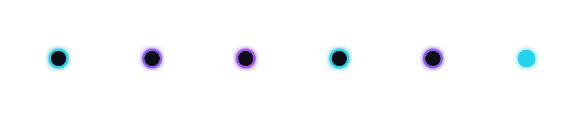

# Hi, I'm Milan Rathod

### Python Developer | Django Developer | AI/ML Enthusiast

*Building practical web applications, REST APIs, and intelligent software solutions.*

 

  
  
  
  

 

  

 

<table width="100%" style="border-collapse: collapse; border: none; background-color: #080B14;">
  <tr style="border: none;">
    <td width="50%" valign="top" style="border: 1px solid #8B5CF6; border-radius: 10px; padding: 20px; background: rgba(139, 92, 246, 0.05);">
      <h3 style="color: #A855F7;">ABOUT MILAN</h3>
      

        B.Sc. Information Technology graduate with hands-on experience building practical web applications using Python, Django, REST APIs, SQLite and OpenCV.
      

    </td>
    <td width="50%" valign="top" style="border: 1px solid #8B5CF6; border-radius: 10px; padding: 20px; background: rgba(139, 92, 246, 0.05);">
      <h3 style="color: #A855F7;">DEVELOPER QUICK INFO</h3>
      

        🎓 <b>Education:</b> B.Sc. Information Technology 
        🎯 <b>Focus:</b> Python / Django / Backend 
        🚀 <b>Exploring:</b> AI / Machine Learning 
        📍 <b>Location:</b> Gujarat, India 
        💼 <b>Career Goal:</b> Python / Django Developer
      

    </td>
  </tr>
</table>

 

<h2 align="center" style="color: #22D3EE;">TECH STACK</h2>
<table width="100%" style="border: none;">
  <tr>
    <td width="50%" valign="top" style="border: 1px solid #8B5CF6; padding: 15px; background: #080B14; border-radius: 10px;">
      <h4 style="color: #A855F7;">PROGRAMMING & WEB</h4>
      
      
      
      
      
    </td>
    <td width="50%" valign="top" style="border: 1px solid #8B5CF6; padding: 15px; background: #080B14; border-radius: 10px;">
      <h4 style="color: #A855F7;">BACKEND</h4>
      
      
      
    </td>
  </tr>
  <tr>
    <td width="50%" valign="top" style="border: 1px solid #8B5CF6; padding: 15px; background: #080B14; border-radius: 10px;">
      <h4 style="color: #A855F7;">DATABASE</h4>
      
      
      
    </td>
    <td width="50%" valign="top" style="border: 1px solid #8B5CF6; padding: 15px; background: #080B14; border-radius: 10px;">
      <h4 style="color: #A855F7;">DATA & AI</h4>
      
      
      
      
    </td>
  </tr>
  <tr>
    <td colspan="2" valign="top" style="border: 1px solid #8B5CF6; padding: 15px; background: #080B14; border-radius: 10px;" align="center">
      <h4 style="color: #A855F7;">TOOLS</h4>
      
      
      
      
      
    </td>
  </tr>
</table>

 

<h2 align="center" style="color: #22D3EE;">🚀 FEATURED PROJECTS</h2>

<table width="100%" style="border: none;">
  <tr>
    <td width="100%" style="border: 1px solid #8B5CF6; padding: 20px; background: #080B14; border-radius: 12px; margin-bottom: 20px; display: block;">
      <h3 style="color: #FFFFFF;">FACE RECOGNITION ATTENDANCE SYSTEM</h3>
      
Python • Django • OpenCV • SQLite • REST API

      
AI-powered attendance system with face recognition, authentication, REST APIs and an admin dashboard.

      

        
        
      

    </td>
  </tr>
  <tr>
    <td width="100%" style="border: 1px solid #8B5CF6; padding: 20px; background: #080B14; border-radius: 12px; margin-bottom: 20px; display: block;">
      <h3 style="color: #FFFFFF;">GYM MANAGEMENT SYSTEM</h3>
      
Python • Django • SQLite

      
Management system for members, memberships, payments, authentication and database operations.

      

        
        
      

    </td>
  </tr>
  <tr>
    <td width="100%" style="border: 1px solid #8B5CF6; padding: 20px; background: #080B14; border-radius: 12px; display: block;">
      <h3 style="color: #FFFFFF;">HOTEL WEBSITE PROJECT</h3>
      
HTML • CSS • JavaScript

      
Responsive hotel website with registration and booking functionality.

      

        
        
      

    </td>
  </tr>
</table>

 

<h2 align="center" style="color: #22D3EE;">🪪 DEVELOPER DASHBOARD</h2>
<table width="100%" style="border: 1px solid #8B5CF6; border-radius: 10px; background-color: #080B14; padding: 20px;">
  <tr>
    <td width="50%" valign="top">
      
<b>Primary Language:</b> Python

      
<b>Primary Framework:</b> Django

      
<b>Backend:</b> Django REST Framework

    </td>
    <td width="50%" valign="top">
      
<b>Database:</b> SQLite

      
<b>AI/ML:</b> OpenCV / NumPy / Pandas

      
<b>Version Control:</b> Git / GitHub

    </td>
  </tr>
  <tr>
    <td colspan="2" align="center" style="padding-top: 15px;">
      
<b>Current Focus:</b> Backend Development + AI/ML

    </td>
  </tr>
</table>

 

<h2 align="center" style="color: #22D3EE;">🌌 MY CONTRIBUTION JOURNEY</h2>

  
  

 

<h2 align="center" style="color: #22D3EE;">🛣️ CURRENT LEARNING</h2>

  

 

  <h2 style="color: #A855F7;">LET'S BUILD SOMETHING TOGETHER</h2>
  

    
    
    
    
  

   
  

